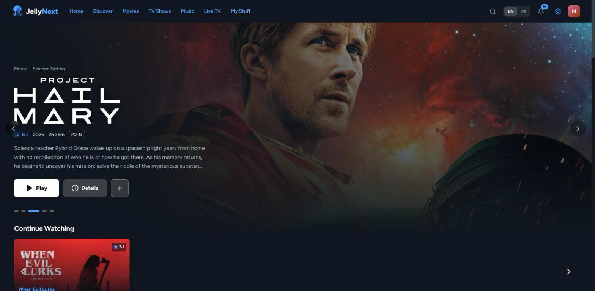
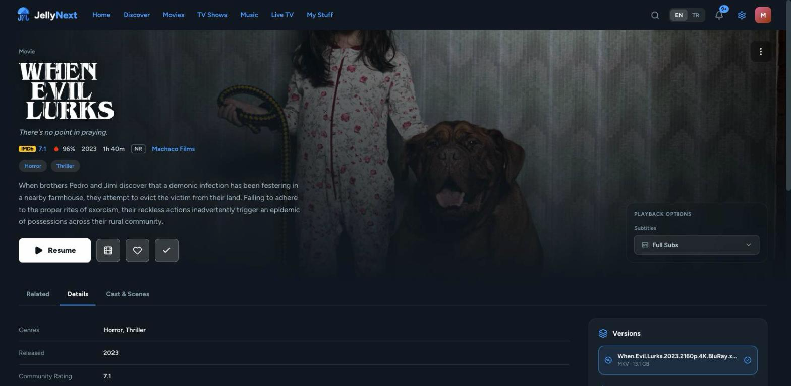
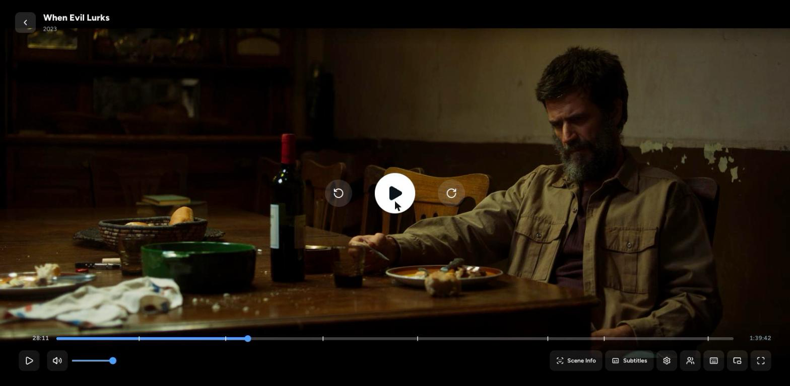
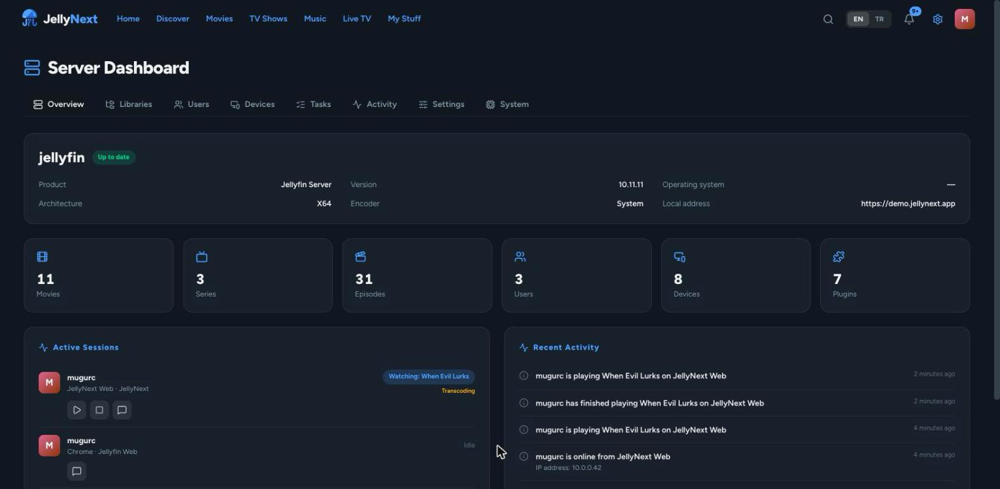
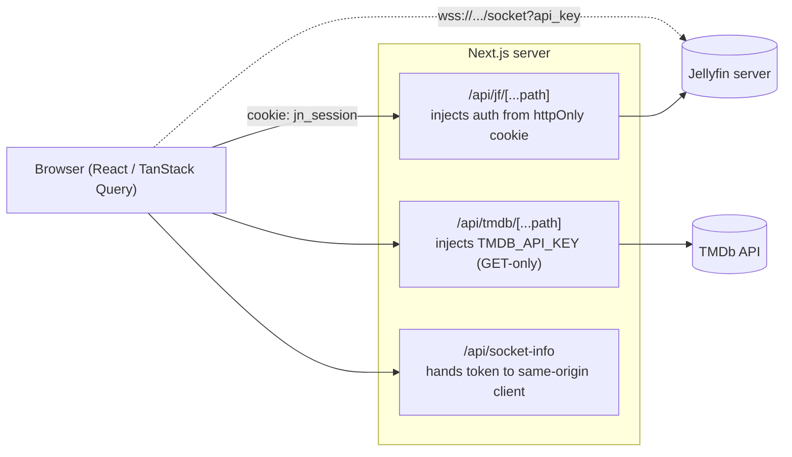

<div align="center">

# 🎬 JellyNext

**A modern, cinematic web client for [Jellyfin](https://jellyfin.org) — built to exercise the _full_ Jellyfin API, read _and_ write.**

[](https://nextjs.org)
[](https://react.dev)
[](https://www.typescriptlang.org)
[](https://tailwindcss.com)
[](#-license)

</div>

---

JellyNext is an alternative front-end for your own Jellyfin media server. Where many clients stop at "browse and play," JellyNext aims for **complete API coverage** — if the Jellyfin API exposes it, JellyNext tries to surface it: metadata editing, image management, playlist sharing, admin dashboard controls, real-time messaging, remote control, watch-together, and more. Everything is bilingual (English / Türkçe) out of the box.

> [!NOTE]
> This is an independent, community project. It is **not affiliated with or endorsed by the Jellyfin project**. You bring your own Jellyfin server.

## Table of contents

- [Screenshots](#screenshots)
- [Highlights](#highlights)
- [Features](#features)
- [Tech stack](#tech-stack)
- [Architecture](#architecture)
- [Getting started](#getting-started)
- [Configuration](#configuration)
- [Available scripts](#available-scripts)
- [Project structure](#project-structure)
- [Internationalization](#internationalization)
- [Security & privacy](#security--privacy)
- [Roadmap & known limitations](#roadmap--known-limitations)
- [Contributing](#contributing)
- [Acknowledgements](#acknowledgements)
- [License](#-license)

## Screenshots

|     Home — billboard & title logos     |     Detail — metadata, versions, playback      |
| :------------------------------------: | :--------------------------------------------: |
|      |          |
|       **Player — full controls**       |          **Admin — server dashboard**          |
|  |  |

## Highlights

- 🎨 **Cinematic UI** — full-bleed billboard with crossfade + auto-advancing progress indicator, title-logo artwork (Jellyfin `Logo` images and TMDb logos), a scroll-aware frosted-glass header, and a minimal, fade-first motion system that respects `prefers-reduced-motion`.
- 🔌 **Full-API mindset** — create/update/delete and actions, not just display. Metadata editing, image downloads, playlist sharing, admin server settings, scheduled-task triggers, API keys, backups, and more.
- 🔐 **Token-safe by design** — your Jellyfin access token lives in an httpOnly cookie and is injected server-side by a BFF proxy; it is never handed to page JavaScript for REST calls.
- ⚡ **Real-time** — a single WebSocket powers toast messages, a notification center, remote playback control, SyncPlay "watch together," and live admin session/activity updates.
- 🌍 **Bilingual** — every string is translated (EN / TR) via `next-intl`, switchable at runtime.
- 🧩 **Discovery** — an optional TMDb-powered "Discover" page surfaces worldwide trending/new titles (info-only), with a one-click check for what's already in your library.

## Features

<details open>
<summary><strong>Authentication & servers</strong></summary>

- **Server-first login** — the first screen asks for your Jellyfin server address (no hardcoded server); optionally pre-filled from an env var.
- **"Who's watching"** multi-user picker and standard username/password sign-in.
- **Quick Connect** — approve a device that's signing in with a code, right from Preferences.
- Session is stored in an httpOnly cookie; the active server URL and UI language persist across visits.

</details>

<details>
<summary><strong>Browse & discover</strong></summary>

- **Home** — billboard hero, Continue Watching, Next Up, Your Favorites, server-computed **Suggestions**, "New in your library," Top Rated, per-library "Recently Added," and genre-discovery rows.
- **Movies / TV** libraries — rich filtering (genre, year, official rating, tags, studios, A–Z jump, quick watched/unwatched/favorites), **bidirectional sorting** (pick a field, toggle ascending/descending), and grid/list layouts. Sort + view choices sync **server-side via DisplayPreferences** so they follow you across devices.
- **Discover** (optional, TMDb) — worldwide trending & new movies/shows as info-only pages, with trailers and a "in your library?" match. The Discover tab only appears when a TMDb key is configured.
- **Search** — debounced, with type chips (movies/shows/episodes/collections/people), a people row, and recent-search history.
- **Music** — albums & artists, album/artist detail, and a persistent Now-Playing bar.
- **Live TV** — channels, guide, and recordings (gracefully empty when Live TV isn't configured).
- **My Stuff** — Favorites, Collections, and Playlists.

</details>

<details>
<summary><strong>Detail pages (movies · series · seasons · episodes · people · collections · playlists)</strong></summary>

- Cast & crew, similar titles, special features, external links (IMDb/TMDb), taglines, ratings, and title-logo artwork.
- **Write operations**: favorite / mark-played toggles, add to collection or playlist, edit metadata, manage images (download from providers, reorder, set), **Identify** (re-match metadata), and delete.
- **Playlist management** — rename, public/private visibility, per-user sharing (view/edit), reorder, and delete.
- Person pages enriched with filmography and cross-navigation.

</details>

<details>
<summary><strong>Player</strong></summary>

- HLS full-timeline VOD playback (`hls.js`) with accurate seeking and resume.
- **Audio & subtitle track selection** (track-level), subtitle **search / download / upload / delete**, subtitle offset, secondary subtitles, and size preferences.
- Skip-intro, next-episode, play queue, chapters, playback-speed, Picture-in-Picture, volume boost/normalize, and a **playback-stats** overlay.
- **All the classic keyboard shortcuts** (space/k play-pause, ←/→ & j/l seek, ↑/↓ volume, 0–9 jump, f fullscreen, m mute, c captions, `<`/`>` speed, ⇧N/⇧P episode, and a `?` cheat-sheet).
- Reports playback state back to the server; can be **remote-controlled** by other clients (including the official dashboard).
- **SyncPlay** — drive or follow a watch-together group.

</details>

<details>
<summary><strong>Admin dashboard</strong></summary>

- Server info, item counts, and **live sessions** (pushed over the WebSocket).
- **Users** — create, edit profile & policy, set/reset password, upload avatar, delete.
- **Libraries** — add/remove, edit paths, trigger scans.
- **Scheduled tasks** — run now and **edit triggers** (daily/weekly/interval/startup).
- **Devices** — rename or remove (your current device is protected).
- **Plugins** — browse the catalog, install, enable/disable, and edit configuration.
- **API keys** and **backups** management.
- **Server settings** — edit general config, metadata language/country, and login **branding** (disclaimer / custom CSS / splash screen).
- Send messages to and remote-control other sessions; restart / shut down the server.

</details>

<details>
<summary><strong>Real-time & personalization</strong></summary>

- **Notification center** in the header — merges admin "Send message" toasts with the server **Activity Log**, with client-side unread tracking.
- **Per-user avatars** — deterministic, name-derived colors (or your uploaded image), consistent everywhere.
- **Preferences** — max quality, autoplay next/trailers, subtitle defaults & size, audio normalize, reduce-motion, and language.

</details>

## Tech stack

| Area                  | Choice                                                          |
| --------------------- | --------------------------------------------------------------- |
| Framework             | **Next.js 16** (App Router, Turbopack, React Server Components) |
| UI                    | **React 19**, **TypeScript 5**, **Tailwind CSS v4**             |
| Data fetching / cache | **TanStack Query v5**                                           |
| Client state          | **zustand v5** (with `persist` for preferences)                 |
| Jellyfin types        | **`@jellyfin/sdk`** (types + endpoint reference)                |
| Playback              | **hls.js**                                                      |
| i18n                  | **next-intl v4** (EN / TR)                                      |
| HTTP (server)         | **undici v8** (custom keep-alive dispatcher)                    |
| Icons                 | **lucide-react**                                                |
| Tooling               | ESLint 9, Prettier, Husky + lint-staged                         |

## Architecture

JellyNext is a Next.js App Router app split into two route groups:

- **`(auth)`** — the login flow (server address → who's watching → sign in).
- **`(app)`** — everything else, gated on a server-side session check in the layout (redirects to `/login` when unauthenticated).

All communication with Jellyfin flows through a **Backend-for-Frontend (BFF) proxy**, so the browser never holds the raw access token for REST:



**Key pieces**

- **BFF proxy** (`app/api/jf/[...path]/route.ts`) — forwards every Jellyfin request, injecting the access token + device id from the httpOnly `jn_session` cookie. Passes through `Range` headers and request aborts (`signal`) so seeking and track switches cancel cleanly.
- **Custom undici dispatcher** (`lib/http/dispatcher.ts`) — a short `keepAliveTimeout` (4s) and `headersTimeout` (30s) prevent stale keep-alive sockets from hanging playback when the server sits behind a reverse proxy / Cloudflare.
- **TMDb proxy** (`app/api/tmdb/[...path]/route.ts`) — GET-only; injects `TMDB_API_KEY` server-side and returns `501` when it isn't configured, keeping the key off the client.
- **Sessions** (`lib/jellyfin/session.ts`) — httpOnly `jn_session` (server URL, token, user, device, admin flag); a readable `jn_server` for the active server; and `jn_locale` for the UI language.
- **Real-time** (`components/shell/realtime-messages.tsx` + `app/api/socket-info/route.ts`) — one WebSocket carries DisplayMessages, remote playback control, SyncPlay, live sessions, and Activity Log updates.
- **State** — TanStack Query is the server-cache of record; zustand holds client state (preferences, play queue, remote-control command bus, SyncPlay, notifications).

## Getting started

### Prerequisites

- **Node.js 20.9+** (22 LTS recommended)
- **npm** (or pnpm / yarn / bun — examples use npm)
- A running **Jellyfin server** you can reach from where you run JellyNext

### Install & run

```bash
# 1. Clone
git clone https://github.com/<your-username>/jellynext.git
cd jellynext

# 2. Install dependencies
npm install

# 3. (Optional) configure environment — see "Configuration" below
cp .env.example .env.local   # then edit

# 4. Start the dev server
npm run dev
```

Open <http://localhost:3000> and enter your Jellyfin server address on the welcome screen.

### Production build

```bash
npm run build
npm run start
```

## Configuration

All configuration is optional — JellyNext works with zero env vars (you'll just type your server address at login, and the Discover page will be disabled). Create a `.env.local` (git-ignored) to set them:

| Variable                          | Scope           | Required | Description                                                                                                                                                                                                                                                |
| --------------------------------- | --------------- | -------- | ---------------------------------------------------------------------------------------------------------------------------------------------------------------------------------------------------------------------------------------------------------- |
| `NEXT_PUBLIC_JELLYFIN_SERVER_URL` | client          | No       | Pre-fills the server address on the login screen. If unset, login begins with server-address entry.                                                                                                                                                        |
| `TMDB_API_KEY`                    | **server only** | No       | A [TMDb v3 API key](https://developer.themoviedb.org/docs/getting-started). Enables the **Discover** page (worldwide trending/new + title logos). **Without it, the Discover tab and its route are hidden entirely** — the rest of the app works normally. |

Example `.env.local`:

```dotenv
# Optional: pre-fill the login server field
NEXT_PUBLIC_JELLYFIN_SERVER_URL=https://jellyfin.example.com

# Optional: enable the Discover page (kept server-side, never sent to the browser)
TMDB_API_KEY=your_tmdb_v3_api_key
```

> [!TIP]
> Consider committing a `.env.example` (without real values) so contributors know which variables exist.

## Available scripts

| Script                 | What it does                     |
| ---------------------- | -------------------------------- |
| `npm run dev`          | Start the dev server (Turbopack) |
| `npm run build`        | Production build                 |
| `npm run start`        | Serve the production build       |
| `npm run lint`         | Run ESLint                       |
| `npm run lint:fix`     | ESLint with autofix              |
| `npm run typecheck`    | `tsc --noEmit`                   |
| `npm run format`       | Prettier write                   |
| `npm run format:check` | Prettier check                   |

A Husky **pre-commit** hook runs `lint-staged` (ESLint + Prettier on staged files).

## Project structure

```
src/
├─ app/
│  ├─ (auth)/login/            # server-address → who's-watching → sign-in
│  ├─ (app)/                   # session-gated app shell
│  │  ├─ home, movies, tv, music, live, discover, search, my-stuff, prefs
│  │  ├─ item/[id]             # unified detail (movie/series/episode/album/…)
│  │  ├─ watch/[id]            # player
│  │  ├─ person/[id]
│  │  └─ admin/…               # dashboard, users, libraries, plugins
│  ├─ api/
│  │  ├─ jf/[...path]          # BFF proxy → Jellyfin (auth injection)
│  │  ├─ tmdb/[...path]        # BFF proxy → TMDb (key injection, GET-only)
│  │  └─ socket-info           # hands socket credentials to the client
│  ├─ globals.css              # theme tokens + motion system
│  └─ layout.tsx
├─ components/                 # feature UIs (home, detail, player, admin, media, shell, …)
├─ lib/
│  ├─ jellyfin/                # queries, mutations, session, playback, media helpers
│  ├─ http/dispatcher.ts       # undici keep-alive agent
│  ├─ player/ · notifications/ · prefs/ · search/   # zustand stores & helpers
│  ├─ tmdb/                    # TMDb queries
│  └─ auth/current-user.tsx    # session context
├─ i18n/                       # next-intl config + request handler
├─ messages/                   # en.json · tr.json
└─ config/nav.ts
```

## Internationalization

- Powered by **next-intl**; locales live in `src/messages/{en,tr}.json`.
- The selected language persists in a `jn_locale` cookie and can be toggled from the header.
- **Contribution rule:** every user-facing string must exist in **both** `en.json` and `tr.json`. Adding a new language is as simple as adding a `messages/<locale>.json` and registering it in `src/i18n/config.ts`.

## Security & privacy

- **Access token** stays in an httpOnly cookie; REST requests are proxied so page JavaScript never reads it.
- **TMDb API key** is server-only and injected by the proxy.
- **WebSocket caveat:** a browser WebSocket can't send httpOnly cookies, so the token is surfaced to the authenticated, same-origin client to open the socket. This does **not** widen the attack surface — same-origin JS can already act as the user via the proxy — and it mirrors how the official Jellyfin Web client works.
- JellyNext talks only to the Jellyfin server **you** configure and (optionally) TMDb. There is no telemetry.

## Roadmap & known limitations

Some areas are implemented against the API but can't be fully exercised without the right server data/hardware, and may be rough:

- **Live TV** beyond channels/recordings (guide grid, timers, series timers, tuner hosts, listing providers).
- **Trickplay** scrubbing thumbnails.
- **Lyrics** and deeper music features.
- **DLNA** profiles.

Jellyfin's legacy per-user **Notifications API** is gone on modern servers, so the notification center is built on the **Activity Log** instead.

Contributions that flesh these out (ideally with a server that has the data) are very welcome.

## Contributing

Contributions are welcome! A few guidelines that keep the project consistent:

1. **Completeness over minimalism.** When you touch a feature, ask "does the API expose more here?" and build the create/update/delete/action, not just the display.
2. **Bilingual.** Add EN **and** TR strings for every new piece of text.
3. **Green checks.** Keep `npm run build`, `npm run typecheck`, and `npm run lint` passing.
4. **Match the surrounding code** — mirror existing patterns (query hooks in `lib/jellyfin`, portaled modals, the motion utilities, etc.).

```bash
# before opening a PR
npm run typecheck && npm run lint && npm run build
```

## Acknowledgements

- [Jellyfin](https://jellyfin.org) — the free software media system this client is built for.
- [The Movie Database (TMDb)](https://www.themoviedb.org) — powers the optional Discover page. _This product uses the TMDb API but is not endorsed or certified by TMDb._
- [Next.js](https://nextjs.org), [TanStack Query](https://tanstack.com/query), [Tailwind CSS](https://tailwindcss.com), [zustand](https://github.com/pmndrs/zustand), [hls.js](https://github.com/video-dev/hls.js), and [lucide](https://lucide.dev).

## 📄 License

Released under the **MIT License** © 2026 Mahmut Uğur Çeker. See [`LICENSE`](LICENSE) for details.

---

<div align="center">
Made with ♥ for self-hosters. Not affiliated with the Jellyfin project.
</div>
